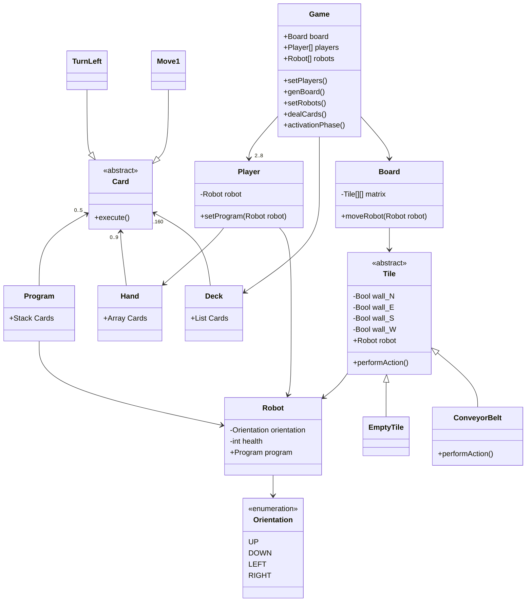

```mermaid
    classDiagram
        direction TD

        class Board {
        -Tile[][] matrix
        +moveRobot(Robot robot)
        }

        class Tile {
            <<abstract>>
            -Bool wall_N
            -Bool wall_E
            -Bool wall_S
            -Bool wall_W
            +Robot robot
            +performAction()
        }

        class ConveyorBelt{
            +performAction()
        }

        class Game {
        +Board board
        +Player[] players
        +Robot[] robots
        +setPlayers()
        +genBoard()
        +setRobots()
        +dealCards()
        +activationPhase()
        }

        class Player {
        -Robot robot
        +setProgram(Robot robot)
        }

        class Robot {
        -Orientation orientation
        -int health
        +Program program
        }

        class Orientation {
        <<enumeration>>
        UP
        DOWN
        LEFT
        RIGHT
        }

        class Card {
            <<abstract>>
            +execute()
        }

        class Hand {
            +Array Cards
        }

        class Program {
            +Stack Cards
        }

        class Move1
        class TurnLeft

        class Deck {
            +List Cards
        }

        class EmptyTile
        class ConveyorBelt


        Game --> Board
        Game --> Deck
        Game --> "2..8" Player
        Board --> Tile

        Robot --> Orientation
        Tile <|-- ConveyorBelt
        Tile <|-- EmptyTile
        Tile --> Robot

        Program --> Robot

        Card "0..160" <-- Deck
        Card "0..9" <-- Hand
        Card "0..5" <-- Program
        
        Player --> Robot
        Player --> Hand

        Move1 --|> Card
        TurnLeft --|> Card
```